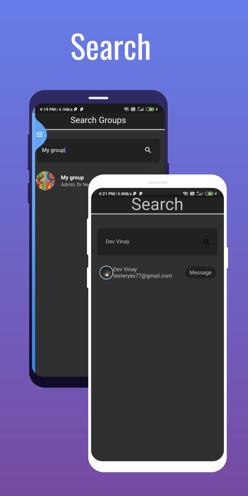

# Like Minded 

A Flutter Chat App With Group Create, Join  Feature and profile update feature

## Getting Started
- clone repo 
- set up firebase
-  run flutter pub get
-  flutter run 
- And your Done :)
# ScreenShot

- For More Screenshot Check screenshot folder
- for cool graphics and images visit https://hotpot.ai/
